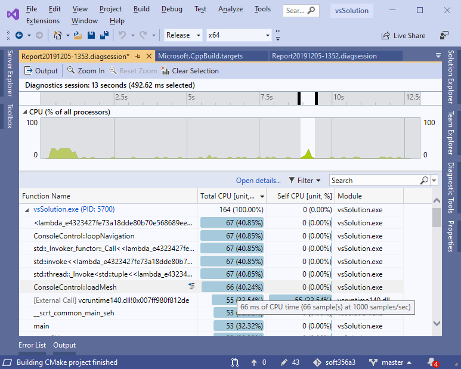
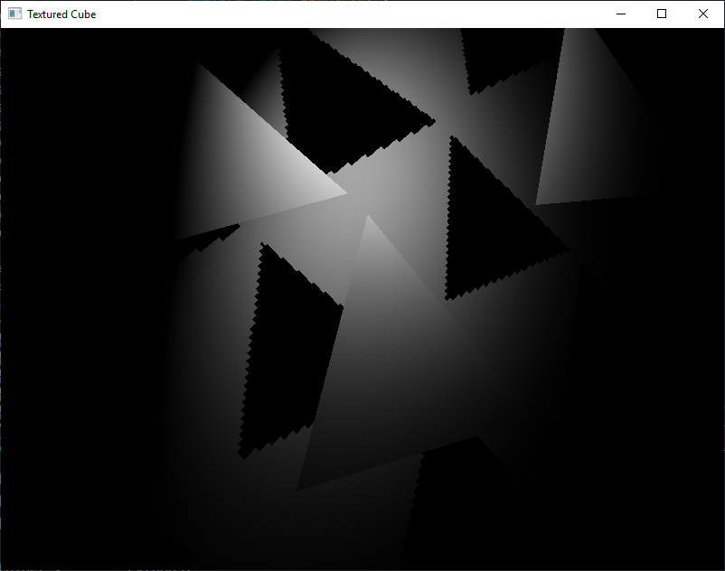
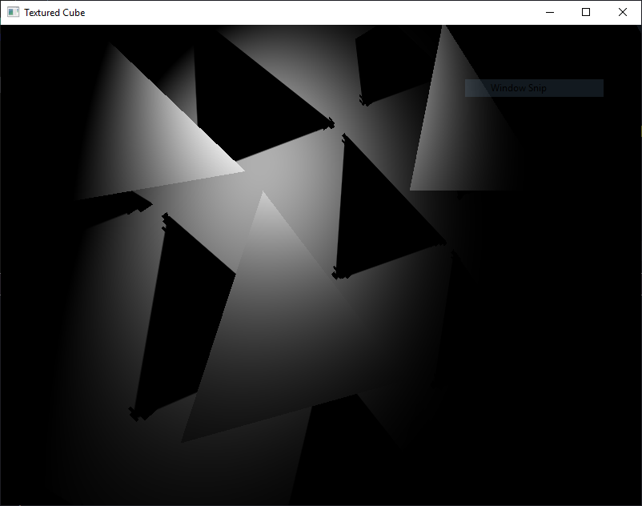

### Introduction ###

This model loader can load COLLADA and .OBJ files, export and load to a compressed file format, move the models in 3D space, switch between PHONG spot lighting and PHONG spot lighting with shadows, (using a special shadow map filtering technique). It uses CPU-parallelism to speed up loading of COLLADA & OBJ files.

### Description ###

This model loader has been developed with file I/O & parsing performance as a priority. This has caused the use of a finite state machine parsing first stage, then possibly followed by a second map-reduce-esque stage, where mapping and filtering of elements can be parallelized. The model loader has also been written with streaming in mind, however currently this is not performed.

### All changes since demo ###

 * Fix numerous bugs in the shadow mapping
 * Implement model rotation around Z axis using Y & U
 * Upload photos of "equation" shadow mapping

### Project aims ###

Goals:

  ☑ Import OBJ files

  ☑ Import DAE files

  ☑ Export to a compressed format (.FUZ)

  ☑ Load textures from models

  ☑ Override textures on models with another

  ☑ Implement PHONG lighting

  ☑ Implement shadow mapping
  
  ☑ Implement a custom shadow mapping algorithm "Equation mapping"

  ☑ Instances of models can be removed

  ☑ The data of a models can be deleted and the associated memory freed

  ☑ Safely fail fuzzed OBJ files

  ☑ Safely fail fuzzed DAE files

  ☑ Free all memory promptly so as not to cause memory leaks

  ☑ Import from the format exported to

### Used software ###

The project was developed mainly in CLion with CMake, due to the authors familiarity with phpStorm, IDEA, pyCharm & RIDER, much of development was also in VS19, however not using Cmake.

CLion was mainly used for:
 * heavy refactoring/programming, easy due to the semantics aware refactoring tools provided in jetbrains IDEs
 * testing WSL & MinGW support
 * using valgrind

 VS19 has to be used for:
 * Heap profiling
 * Performance analyizing, which is essential for finding bottlenecks such as unnecessary memory copying between function calls
 * Lab computer support

Valgrind helped diagnose various problems including:
 * 2 cases of heap corruption
 * 1 case of overrite bounds of a span of memory

gDebugger is an incredibly useful tool, which I've used in the development of various parts, most helpfully is allowed me to diagnose an issue caused by nvidia disallowing a colour depth of > 10 bits on its consumer GPUs

### Used libraries ###

The only used libraries are GLFW, GLEW, GLUT, GLM and STB.

### Setup ###

Clone the project and open the VS solution, add the glm include dir to the project's include dirs and it should compile and run. You may need to tweek the "prefix" parameter if the shaders arn't relative to the working dir.

### Source layout ###

#### src folder ####

(*loose individual files*:)
 * ConsoleControl: all the console loop logic
 * SafeIndex: fast std::vector access checking as the built in is slow.

daeParser:
 * bufferParseResult: a struct containing the results of the operation which parses the float and index buffers.
 * daeParser: contains most the logic for parsing the bytes into xml and the xml into a model, relatively messy due to the large number of edge cases in the COLLADA specification.
 * DoParallel: simply executes functions generated by a lambda from an int in parallel.
 * stringToFloatFast: a custom float parser. According to all resources online on float parsing, writing a native routine to consume the characters one by one is fastest, unless the floats are garunteed to be a specific format, then SIMD can be used (this was looked into but proved to be impossible).
 * typeDefs: simply shortcuts for certain types, e.g. std::vector<xmlNode>.
 * xmlNode: lightweight struct used in both the parsing of the xml and the stages therafter.
 * XMLParseState: enum of 6 states of the FSM xml parser.
 * xmlParsingStackMember: the stack of the FSM xml parser is formed of these.

dotFuz:
 * bitBuffer: methods for packing individual bits into a char
 * dotFuzFormat: methods for encoding decoding to the format
 * GMM: struct with logic for fitting MaxEnt 1D gaussian mixture model
 * HuffmanCoding: Takes a probability distribution and encodes it into a varying length string of bits, ala morse code.
 
files:
 * fileReader: fast file reading
 * fs: preprocessor directives for access to std::filesystem on both MinGW & MSVC

graphics:
 * Mesh: this file contains both the structure for MeshData, and Mesh, one has the purpose of being a data transfer object, the other has a purpose of being what instances (eventually) point to, and talks with openGL.
 * Texture: bog standard texture logic
 * Vertex: contains 2 structs, vertex and triangle, who have 11 & 4, 4 byte primitives, inside respectively

objParsing:
 * objParser: the obj parser .cpp is much shorter than the .dae, less than 400 lines, and so is much less of a mess. Also contains mtl parsing.
 
shaders:
 * shader: a vert, geom, frag, etc. shader
 * shaderProgram: a set of invidiual shaders
 * shaderType: the only inheritance in the project, individual classes for each of vert, frag and geom.

### Commands and controls ###

 - **exit**: exits the program
 - **..**: goes up a directory
 - **load `FILENAME`**: loads the filename if it's a .obj, .fuz or .dae
 - **`FOLDERNAME`**: goes into a folder
 - **override texture `TEXTUTE`**: loads the texture and uses it when displaying a model
 - **export**: exports a model, will ask you which model to export and what to call it
 - **fuzz `FILENAME`**: fuzzes loading a filename with varying levels of corruption, be careful, will actually load broken models into scene
 - **list meshes**: lists the available meshes
 - **shadows on**: turns on shadows
 - **shadows off**: turns off shadows
 - **remove file**: asks which file you want to remove, and removes it, freeing memory

Key presses:
 * Exit - escape
 * Switch model - hold z or x
 * Delete instance - delete
 * Scale model - hold 5 or 6
 * Move model - TFGH 4R
 * Move camera - WASD SHIFT CTRL
 * Rotate model around Z - Y & U
 * Turn camera - IJKL QE

### DAE parsing ###

The parsing of the DAE is initially done in serial, as it's not clear how the most efficient way to parse a heirarchical data structure in parallel, and doing so in serial may be more efficient in terms of computing power. However this is extreamly light weight parsing only the start and end index and the children of each node. Then, the real heavy weight processing, such as converting the character arrays to floats, can be done in parallel.

Regular expressions can be fast, however this method will surely be faster.

All these performance optimizations allow the largest file, the 10MB pouf.dae to be loaded in a *lightning fast* 66 miliseconds:

### Dot fuz ###

As entertainment systems become more connected, space taken for assets will be more and more of a burden. And even while most assets are not downloaded on the fly, AAA games are approaching the limits of a sensible download (users are not keen to wait for dozens of gigabytes).

Dot-FUZ (Distribution, Optimization, Three-D, Format, Used for, Zipping) uses information theory to code the data into as few bits as possible.

    *key term: nat, the unit of information arcording 1 base e digit*

It fits a gaussian mixture model to mazimise the entropy of the distribution, i.e. is most likely to give the data to be encoded. A maximum entropy model of the underlying data is extreamly useful, as when the length of a symbol is proportional to the negative logarithm of the probability of the symbol, the maximum entropy distribution minimizes the average message length.

The format can either be lossless or lossy depending on a tolerance setting, if the tolerance setting is set to be the minimum value of a float/double, it's effectively lossless. However the tolerance is used twice, once to deduplicate all float values (all colour values, positions, normal values, and texture coordinates), and once to specifiy the bits of precisison when encoding that float into a binary string.

The overall process then is to bucket all the floating point values, fit a GMM to the bucketed floats, and then write these floats in an ultra-compressed format, which could take around a dozen bits, rather than 32.

The file format is successful, compressing the 10MB pouf.dae to 4MB.  

### Shadow mapping technique ###

The typical problem of "Jaggies" (see wikipedia) in shadows is approached via multi-sampling or other methods. 

The approach used here is different, the "staircases" are smoothed by sampling the nearby pixels in the relevant shadow maps to recover the information (edge start, edge end, center of triangle), of the triangles which are causing the staircase.

This is done by encoding this information about the triangle causing the staircases into multiple shadow maps. The information encoded is:
 * Start of edge (shadowmap texture coordinates x, y)
 * End of edge (shadowmap texture coordinates x, y)
 * The center of the triangle (shadowmap texture coordinates x, y)
 * A 32 bit hash of the triangles vertexes positions, stored as 4, 8 bit ints (RGBA_8I)
 * And of course the standard depth to light
 
This information requires the use of geometry shader to discover, and a geometry shader so as to divide a triangle into subtriangles which have a defined outside edge, although these are the same shader.

The main difficulty with this apparoach is the **significant** nondeteminism of NVIDIA GPUs, preventing simple de-duplication of the triangles responsible for the artifact
 
This approach yields much nicer results, however some artifacts of course exist, the two photos below have the same shadow map resolution:

The standard shadow mapping:

The custom "equation" shadow mapping technique developed:

